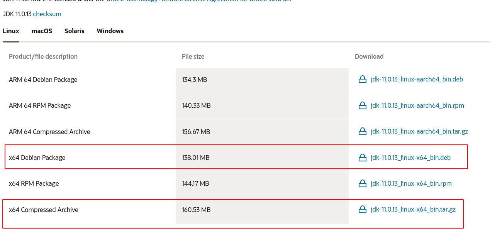
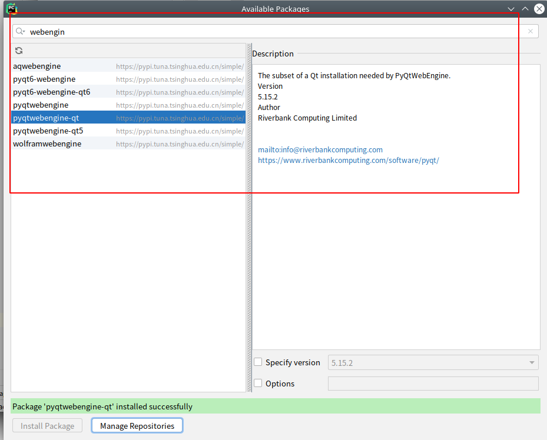
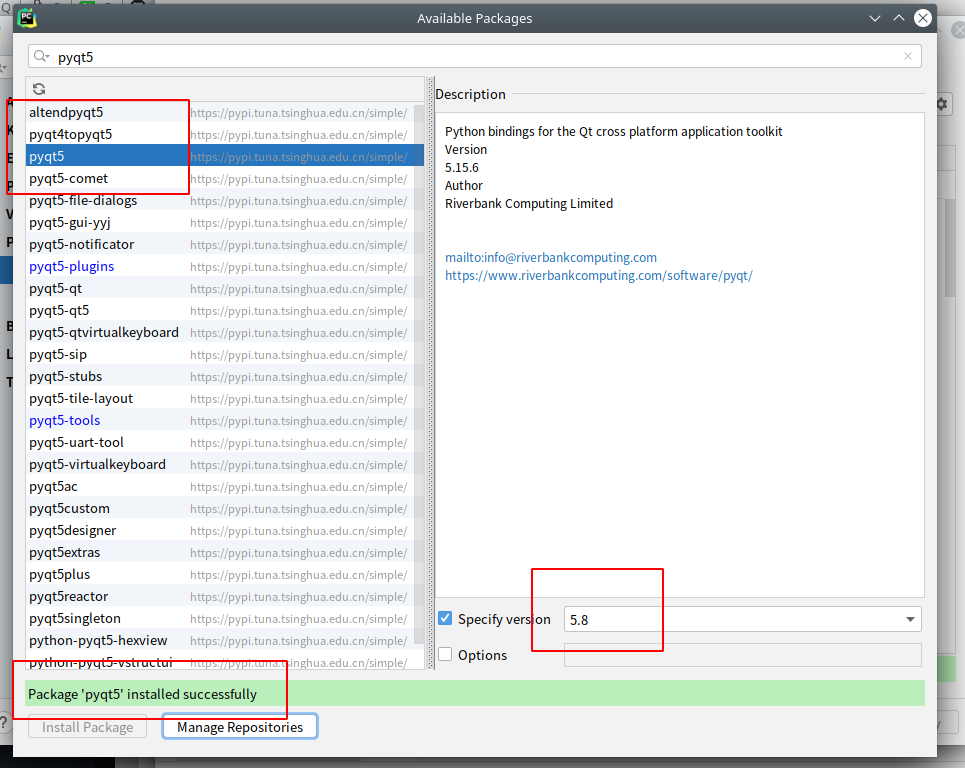

<!--
 * @Author: zhanghao
 * @Date: 2021-10-31 17:09:12
 * @LastEditTime: 2021-11-01 00:26:00
 * @Description: Do not edit
 * @FilePath: /Self_Notes/Java环境配置.md
-->


## Debian 

### apt安装
直接 使用 apt-get 安装
```shell
$ sudo apt-get update
$ sudo apt-get install openjdk-11-jdk
$ jave -version
```

or install oracle Java JDK: <br />
https://www.oracle.com/java/technologies/



推荐 xxx_linux-x64_bin.tar.gz 文件

下载之后,下述操作进行安装 :

```shell
zhanghao@debian:~$ sudo mkdir /usr/lib
lib/     lib32/   lib64/   libexec/ libx32/  
zhanghao@debian:~$ sudo mkdir /usr/lib/
Display all 113 possibilities? (y or n)
zhanghao@debian:~$ sudo mkdir /usr/lib/jvm
[sudo] zhanghao 的密码：
zhanghao@debian:~$ sudo cp ~/下载/jdk-11.0.13_linux-x64_bin.tar.gz /usr/lib/jvm/
zhanghao@debian:~$ cd /usr/lib/jvm/
zhanghao@debian:/usr/lib/jvm$ ls
jdk-11.0.13_linux-x64_bin.tar.gz
zhanghao@debian:/usr/lib/jvm$ sudo tar -zxv
-zxva  -zxvC  -zxvg  -zxvH  -zxvj  -zxvK  -zxvm  -zxvN  -zxvp  -zxvs  -zxvU  -zxvW  
-zxvb  -zxvf  -zxvG  -zxvi  -zxvJ  -zxvl  -zxvM  -zxvo  -zxvP  -zxvS  -zxvV  -zxvX  
-zxvB  -zxvF  -zxvh  -zxvI  -zxvk  -zxvL  -zxvn  -zxvO  -zxvR  -zxvT  -zxvw  -zxvZ  
zhanghao@debian:/usr/lib/jvm$ sudo tar -zxvf jdk-11.0.13_linux-x64_bin.tar.gz 
zhanghao@debian:/usr/lib/jvm$ ls
jdk-11.0.13  jdk-11.0.13_linux-x64_bin.tar.gz
```

配置环境变量 :
```shell
zhanghao@debian:/usr/lib/jvm$ sudo vim ~/.bashrc 

添加以下内容 :

# 配置 java 的环境变量
# set oracle jdk environment 
export JAVA_HOME=/usr/lib/jvm/jdk-11.0.13
export CLASSPATH=${JAVA_HOME}/lib
export PATH=$PATH:${JAVA_HOME}/bin


zhanghao@debian:/usr/lib/jvm$ source ~/.bashrc 
zhanghao@debian:/usr/lib/jvm$ java -version
java version "11.0.13" 2021-10-19 LTS
Java(TM) SE Runtime Environment 18.9 (build 11.0.13+10-LTS-370)
Java HotSpot(TM) 64-Bit Server VM 18.9 (build 11.0.13+10-LTS-370, mixed mode)
```


同时安装 jdk-8 (debian 的 库里没有 openjdk-8)

目前 Java OpenJDK 8 版本 8 在官方 Debian Buster 存储库中不可用，我们需要使用第三方源AdoptOpenJDK进行安装。

```shell
首先，更新软件包列表并安装通过HTTPS添加新存储库所需的依赖项，命令如下：

sudo apt-get update
sudo apt install apt-transport-https ca-certificates wget dirmngr gnupg software-properties-common

其次，使用wget命令导入存储库的GPG密钥(该网址国内可能不能直接访问)：
wget -qO - https://adoptopenjdk.jfrog.io/adoptopenjdk/api/gpg/key/public | sudo apt-key add -


添加AdoptOpenJDK APT存储库到你的系统：
sudo add-apt-repository --yes https://adoptopenjdk.jfrog.io/adoptopenjdk/deb/

更新apt源软件列表，启用存储库，安装OpenJDK 8
sudo apt update
sudo apt install adoptopenjdk-8-hotspot


```


```shell
zhanghao@debian:~$ java -version
openjdk version "1.8.0_292"
OpenJDK Runtime Environment (AdoptOpenJDK)(build 1.8.0_292-b10)
OpenJDK 64-Bit Server VM (AdoptOpenJDK)(build 25.292-b10, mixed mode)

```


如果之前系统上安装了其他版本的JDK，系统默认显示的依旧为之前版本信息，只是后需要通过命令来显示Java版本列表，并选择某一个作为系统默认版本的Java。

```shell
sudo update-alternatives --config java
```








