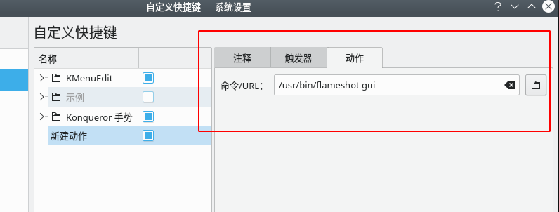

VScode 完美工作区的搭建 :


## Markdown 相关 

插件 : Markdown All in One 一些快捷操作集合

Markdown 侧边预览优化 : Markdown Preview Enhanced


Markdown 图片复制 :

使用插件 : `Paste Image`
- 在编写md需要插入图片，这个插件可以将粘贴板的图片保存到本地资源
- 假如我在 /readme.md中编写文档，我需要将粘贴板的图片放在/images/ 下面
- 建议配置在当前 xxx.md 文件目录下的 images/  文件夹中便于整理
> usage : [n] 使用 ,利用, 惯用法

Usage :

- linux : `ctrl + alt + v`

Configure :
- 打开设置,搜索 `Paste Image`
-  配置 :
-  也可以直接在 settings.json 中配置
```json
    //The destination to save image file.
    //You can use variable ${currentFileDir} and ${projectRoot}. 
    //${currentFileDir} will be replace by the path of directory that contain current editing file. 
    //${projectRoot} will be replace by path of the project opened in vscode.
    "pasteImage.path": "${currentFileDir}/images/",


    // 复制的图片的 url 前缀
    // The string prepend to the resolved image path before paste.
    "pasteImage.prefix": "./",

```

同时需要一个截图工具 :  `flameshot`

```shell
zhanghao@debian:~$ sudo apt-get install flameshot -y
zhanghao@debian:~$ which flameshot 
/usr/bin/flameshot

# 在 系统设置 中添加键盘快捷方式 

快捷键 : 自定义
执行的命令 : /usr/bin/flameshot gui

```
同时需要安装 xclip , 才可以 ctrl+alt+v 快速在 Markdown 中插入图片

zhanghao@debian:~$ sudo apt-get install xclip -y




<br />

Markdown Table Formatter : 表格格式化工具


### 自定义 Markdown 预览样式 :


---


## 打击特效

### PowerMode
`Power Mode` 是 VScode 的特效插件

Configure :
- settings.json
```js
// ---------------------------- PowerMode 特效插件相关 -----------------------------//
    // 需要现在插件商店中搜索 PowerMode 并下载安装
    "powermode.enabled": true ,      // 启用插件
    "powermode.enableShake":true ,   // 桌面是否抖动

    "powermode.shakeIntensity": 2,   //屏幕抖动的强度


    // 特效样式
    //"powermode.presets": "flames" ,        // 火焰
    //"powermode.presets":"fireworks" ,      // 烟花
    //"powermode.presets":"exploding-rift" , // 炸裂
    //"powermode.presets":"simple-rift" ,    // 爆炸
    "powermode.presets":"particles" ,        // 粒子
    //"powermode.presets":"magic" ,          // 魔术
    //"powermode.presets":"clippy" ,         // 回形针


    // 组合重置前的秒数
    "powermode.comboTimeout": 10 , 
    
    // 特效随字体颜色改变
    "powermode.backgroundMode": "mask",

    // 适用于爆炸元素的自定义 CSS
    "powermode.customCss": {


    },

    // 设置为false以在键入时禁用爆炸             
    //"powermode.enableExplosions": true,


    // 使用背景图像的 url() 部分可以放入的任何内容
    // 例如base64编码的gif或绝对文件路径WITHOUT引号。URL必须是HTTPS。
    //"powermode.customExplosions": []


    // 爆炸的大小。对于值x，高度设置为x REM，宽度设置为 xCH。 
    //"powermode.explosionSize": 6 ,

    // 爆炸的垂直偏移。增加它将推动爆炸，减少它将使它们下降。              
    //"powermode.explosionOffset": 0.35,

    // 触发爆炸所需的击键次数。2意味着每一秒击键都会爆炸，1意味着每次击键。              
    //"powermode.explosionFrequency": 2,


    // 确定爆炸持续多长时间（毫秒）。设置为0，它将永远持续下去。              
    // "powermode.explosionDuration": 1000,


    // ---------------------------------------------------------------------------------//
    
```


代码编写
自动补全： include autocomplete
括号高亮匹配： Bracket Pair Colorizer
字符数统计： word count
行高亮插件： hightlight line
单词高亮: highlight-words（ctrl + shift + p, highlight 调出命令）
find all references


python环境
python quick print, 快速显示类型
jupyter, jupyter notebook, 特别好用，强烈推荐
vandelay python, 自动添加包信息
pyqt integration, pyqt5 的界面工具


c开发环境搭建
c/c++
c/c++ clang command adapter
clang-format, 自动格式化代码时用的


常用的快捷键
查找文件 ctrl + p
查找函数调用: 右键 -> find all reference
查找其他文件下的函数: ctrl + t
格式化: 右键 -> 格式化
转到右括号: ctrl + alt + \
收缩 & 展开: ctrl + alt + []
多行注释： ctrl + /
查找文件： ctrl + p
当前文件查找内容： ctrl + F
查找项目里面的内容： ctrl + shift + F
替换内容: ctrl + h
功能管理： Ctrl + Alt + P
跳转到上一次编辑位置： alt + 左箭头
跳转到下一次编辑位置： alt + 右箭头
查找本文件的函数： ctrl + shift + p ; @函数名
在查找结果里面跳转到上一个位置： F3
ctrl + shift 12 : 查看定义预览; f12 : 跳转到定义
是否关闭资源管理器: Ctrl + b


MarkDown插入图片并按比例显示


C/C++ 插件 : C/C++


background 插件设置背景图像


Live Server 插件可以实现 边修改代码边预览 html 页面


Code Spell Checker 插件: 拼写检查器

Indent-Rainbow : 让缩进带颜色


Path Intellisense : 自动完成文件名

TODO Highlight : TODO 高亮显示


Trailing Spaces : 突出显示尾随空格,  让空格更加明显


TODO Tree : 在侧边树状视图中显示 TODO


Prettier-Code formatter : 更优雅的代码格式化,  


Code Runner : 可以直接运行所选中的代码
只要选中这些字符，右键run code，就能直接输出结果。
注意会每次执行run code，都会生成一个新文件tempCodeRunnerFile.xxx。


A-super-trabslate : 划线翻译, 鼠标停留选中几秒就会查看翻译内容


Regex Previewer : 实时预览正则表达式的效果


filezise : 在状态栏显示当前文件大小


GitLens : 详细的 Git 提交日志
尤其是多人协作时：哪一行代码，何时、何人提交都有记录


VS Code Counter : 

统计代码总行数、注释行数、空白行数，以及使用的语言。

使用方法：右键需要统计的文件夹—Count lines in directory


View In Borwer : 在浏览器里直接运行 html 文件


Bracket Pair Colorizer : 给嵌套的各种括号加上不同的颜色


Auto Rename Tag : 自动修改匹配的 HTML 标签

Import Cost : 引入包大小计算,对于项目打包后体积掌握很有帮助


Rainbow Fart
在编程时根据代码关键字播放贴近代码意义的真人语音

使用方法(来自官方)：

    在 VSCode 的菜单栏中找到 查看 - 命令面板，或使用快捷键 Ctrl + Shift + P（MacOS Command + Shift + P）呼出 命令面板。在 命令面板 中输入 > Enable Rainbow Fart 并回车。此时应该会弹出一个消息通知，点击通知上的 Open 按钮。在打开的页面上点击 授权。享受编程吧！请尝试在 VSCode 中输入 function 关键字。

    注意：网页页面必须保持打开状态才能在写代码时播放语音。


background-cover
透明背景

然后点击右下角的 switch backgroung   选项


VScode 中画图
- 支持 类图、流程图、时序图、状态图
- 组件图、对象图、部署图、甘特图、 ...
- 所需插件 : PlantUML
- 


Better Comments : 彩色注释

Error Lens :
将编辑器诊断出的警告、错误、语法问题（提示的波浪线）等，以用颜色填充行背景的方式突出提示，并将诊断信息显示在尾部


会了吧

没错，名字就是“会了吧”。

打开源码可以自动分析所有包含的英语单词，并显示解释结果，还可以添加已经会的单词


听网易云音乐 :


